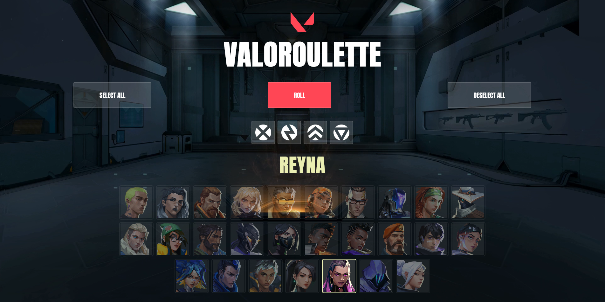

# 🎮 Valoroulette

A modern web app to randomly select Valorant agents for your next match. Built with Next.js 14, TypeScript, and Tailwind CSS.



## 🚀 Quick Start

```bash
# Install dependencies
npm install

# Run development server
npm run dev

# Build for production
npm run build

# Start production server
npm start
```

Visit `http://localhost:3000`

## ✨ Features

- 🎯 **Random Agent Selection** - Roll a random agent from your selected pool
- 🔒 **Lock/Unlock System** - Click agents to lock/unlock them individually
- 🎭 **Role Filtering** - Filter by role (Duelist, Initiator, Controller, Sentinel)
- 📱 **Fully Responsive** - Optimized for mobile, tablet, and desktop
- ⚡ **Fast Performance** - Optimized loading with lazy images and conditional video
- ♿ **Accessible** - WCAG compliant with ARIA labels and keyboard navigation
- 📊 **Analytics** - Vercel Analytics & Speed Insights integrated

## 🎮 How to Use

1. **Select Agents**: All agents are unlocked by default
2. **Filter by Role**: Click role icons to filter agents (others become locked)
3. **Lock Individuals**: Click on any agent to toggle lock/unlock
4. **Roll**: Click the "Roll" button to randomly select an unlocked agent
5. **Quick Actions**:
   - **Select All**: Unlock all agents
   - **Deselect All**: Lock all agents

## 🛠️ Tech Stack

- **Framework**: [Next.js 14](https://nextjs.org/)
- **Language**: [TypeScript](https://www.typescriptlang.org/)
- **Styling**: [Tailwind CSS](https://tailwindcss.com/)
- **Font**: [Anton](https://fonts.google.com/specimen/Anton) (Google Fonts)
- **API**: [Valorant API](https://valorant-api.com/)
- **Analytics**: Vercel Analytics & Speed Insights
- **Deployment**: [Vercel](https://vercel.com/)

## 📦 Project Structure

```
valoroulette/
├── src/
│   ├── app/              # Next.js app directory
│   │   ├── layout.tsx    # Root layout
│   │   ├── page.tsx      # Home page
│   │   └── globals.css   # Global styles
│   ├── components/       # React components
│   │   ├── ActionButtons.tsx
│   │   ├── AgentCard.tsx
│   │   ├── AgentList.tsx
│   │   ├── BackgroundVideo.tsx
│   │   ├── ErrorMessage.tsx
│   │   ├── Header.tsx
│   │   ├── LoadingSpinner.tsx
│   │   ├── RoleFilters.tsx
│   │   └── SelectedAgentName.tsx
│   ├── hooks/            # Custom React hooks
│   │   └── useAgents.ts
│   └── types/            # TypeScript types
│       └── agent.ts
├── public/
│   └── assets/           # Images, videos, icons
├── package.json
├── tsconfig.json
├── tailwind.config.ts
└── next.config.js
```

## 🚀 Deployment

This project is configured for deployment on Vercel:

1. Push your code to GitHub
2. Import the repository on [Vercel](https://vercel.com/new)
3. Vercel will auto-detect Next.js and deploy

## 🌐 Environment

No environment variables required. The Valorant API is public and doesn't need authentication.

## 📊 Performance

- **Lighthouse Score**: 90+ (Mobile & Desktop)
- **Core Web Vitals**: All metrics in "Good" range
- **Bundle Size**: Optimized with Next.js automatic code splitting
- **Images**: Lazy loading and optimized quality
- **Video**: Conditionally loaded based on connection speed

## ♿ Accessibility

- WCAG 2.1 Level AA compliant
- Keyboard navigation support
- Screen reader friendly with ARIA labels
- High contrast colors
- Touch-friendly on mobile (minimum 44px touch targets)

## 🤝 Contributing

Contributions are welcome! Feel free to:
- Report bugs
- Suggest new features
- Submit pull requests

## 📄 License

MIT License - feel free to use this project for your own purposes.

## 👤 Author

**Nohan-V2**
- GitHub: [@Nohan-V2](https://github.com/Nohan-V2)
- Website: [valoroulette-five.vercel.app](https://valoroulette-five.vercel.app)

## 🙏 Acknowledgments

- [Valorant API](https://valorant-api.com/) for providing agent data
- [Riot Games](https://www.riotgames.com/) for Valorant assets
- [Next.js](https://nextjs.org/) team for the amazing framework

## 📝 Version

**Current Version**: 2.0.3

See [CHANGELOG.md](CHANGELOG.md) for version history.
